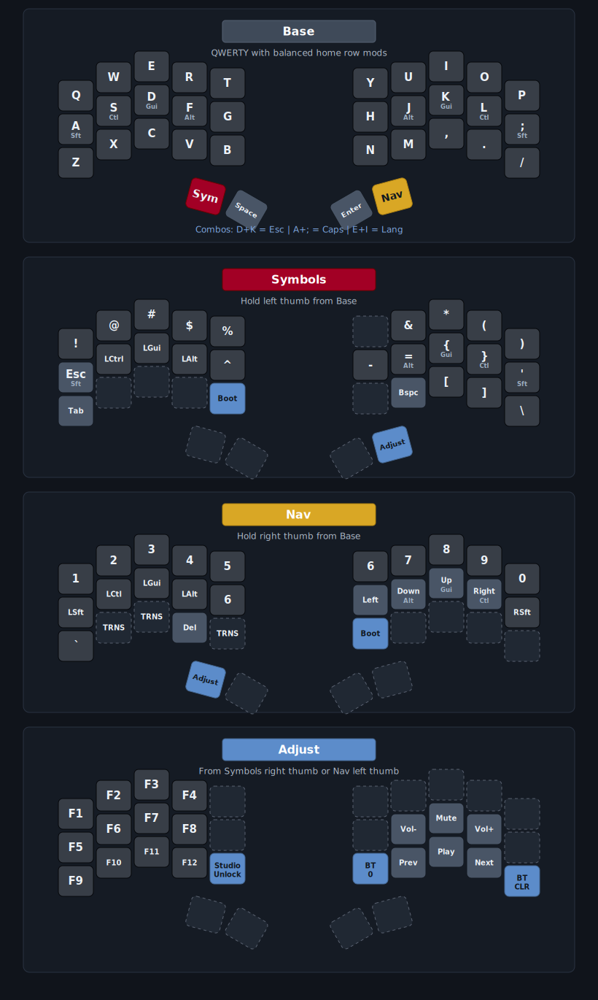

# k4i's split kbd

ZMK firmware for a **Sweep-style cradio** split: **nice!nano v2** + `cradio_left` / `cradio_right`, built from [devpew/swp](https://github.com/devpew/swp). The keyboard name in firmware is `sweep split kbd`.

**Build outputs:** `sweep_l`, `sweep_r`, `sweep_l_b`, `sweep_l_bh`, and `reset` (Bluetooth pairing reset / clear). The left half builds include ZMK Studio (RPC over USB-UART). `sweep_r` is shared by all three keyboards because the right half is the split peripheral and does not advertise as the host Bluetooth keyboard.

The three keyboard variants share the same keymap; only the Bluetooth advertised name differs: **sweep** (default, `sweep split kbd`), **sweep black** (`sweep_split_b`, artifact `sweep_l_b`), and **sweep black heavy** (`sweep_split_bh`, artifact `sweep_l_bh`).

## Quick start

### Flash new firmware

> To build locally without GitHub Actions, see [LOCAL_BUILD_DOCKER.md](LOCAL_BUILD_DOCKER.md).

1. [Fork this repo](https://github.com/briginas/zmk-sweep/fork)
2. (Optional) Edit `config/cradio.keymap` and `config/cradio.conf`.
3. Wait for the GitHub Actions build to finish (the **Actions** tab on your fork), then download the artifact zip from that run and extract the UF2 (or other) files for your halves.
4. Connect the half you are flashing with a USB cable.
5. Enter the bootloader on that half:
   1. A **bootloader** key on **Symbols** or **Nav** (see below), if you can still type
   2. Double-click the reset button
   3. Quickly short the reset button twice (if the button is unreliable)
   4. Quickly short **GND** and **RST** on the controller twice (e.g. second and third pins on the corner row—check your board’s pinout)
6. Copy the correct file to the bootloader drive:
   - Names containing **`_l`** → left half
   - **`sweep_r`** → right half for any of the three keyboards
   - **`reset`** → run on a half to clear Bluetooth state when pairing is stuck (not required for normal keymap or name changes)

### Firmware behavior (config)

- Bluetooth: up to five paired profiles (`CONFIG_BT_MAX_PAIRED=5` in `cradio.conf`).
- Battery reporting for both halves (split central can show the peripheral’s level).
- Idle timeout 30 s; **sleep** after one hour of inactivity.
- **Soft off** is enabled in the build; wakeup is wired via GPIO in the keymap (no `&soft_off` binding in the current layer map—see `config/cradio.keymap` if you add one).
- **Pointing** is enabled in Kconfig (`CONFIG_ZMK_POINTING=y`); the current keymap does not define a mouse layer.

## Keymap (overview)

The layout is intentionally **maximally close to a full-size keyboard**: letters follow normal QWERTY, punctuation on **Symbols** mirrors typical US placement, and **Nav** puts numbers and arrows where you would expect on a standard board. Home row mods on **A S D F** / **J K L ;** are the main ergonomic adaptation; everything else stays familiar so switching from a laptop or desktop keyboard is straightforward.

Home row mods use **balanced** hold-tap (`hml` / `hmr`) on the letters **A S D F** and **J K L ;** (Shift / Ctrl / Gui / Alt as labeled in the map).

**Combos:** **Esc**, **Caps Lock**, and **Lang** (`LG(SPACE)`)—see `combos` in `config/cradio.keymap` for key positions.

  

*This diagram was created using draw.io*
*Click [HERE](https://viewer.diagrams.net/?tags=%7B%7D&highlight=0000ff&edit=_blank&layers=1&nav=1&title=sweep-layout.drawio#Uhttps%3A%2F%2Fraw.githubusercontent.com%2Fbriginas%2Fzmk-sweep%2Fmain%2Fassets%2Fsweep-layout.svg) to view a copy that you can edit*

*This diagram mirrors the current `config/cradio.keymap`. Positions are aligned with full-size keyboard conventions wherever the 34-key split layout allows.*

| Layer       | How you get there                                      | Role                                                                                                                                               |
| ----------- | ------------------------------------------------------ | -------------------------------------------------------------------------------------------------------------------------------------------------- |
| **Base**    | Default                                                | QWERTY; **left thumb** = hold **Symbols**; **right thumb** = hold **Nav**; thumbs share **Space** and **Enter** between them.                      |
| **Symbols** | Hold **left thumb** from Base                          | Punctuation and symbols; **Tab**; **Bootloader** on the left block; right block includes **Backspace**; right thumb → **Adjust**.                  |
| **Nav**     | Hold **right thumb** from Base                         | Numbers; arrows and navigation (with mods on the home row); **Bootloader**; **Adjust** via **left thumb** (`mo 3`).                                |
| **Adjust**  | From **Symbols** (right thumb) or **Nav** (left thumb) | **F1–F12**; **BT_SEL 0** and **BT_CLR**; **studio_unlock**; volume and media keys.                                                                 |

## References

- [Sweep (hardware)](https://github.com/davidphilipbarr/Sweep)
- [Keymap I initially copied](https://www.youtube.com/watch?v=VShLPvF693k)
- [ZMK Documentation](https://zmk.dev/docs)
- [ZMK Keymaps & Behaviors](https://zmk.dev/docs/keymaps)
- [nice!nano product page](https://nicekeyboards.com/nice-nano)
- [devpew/swp — config this was built from](https://github.com/devpew/swp)
